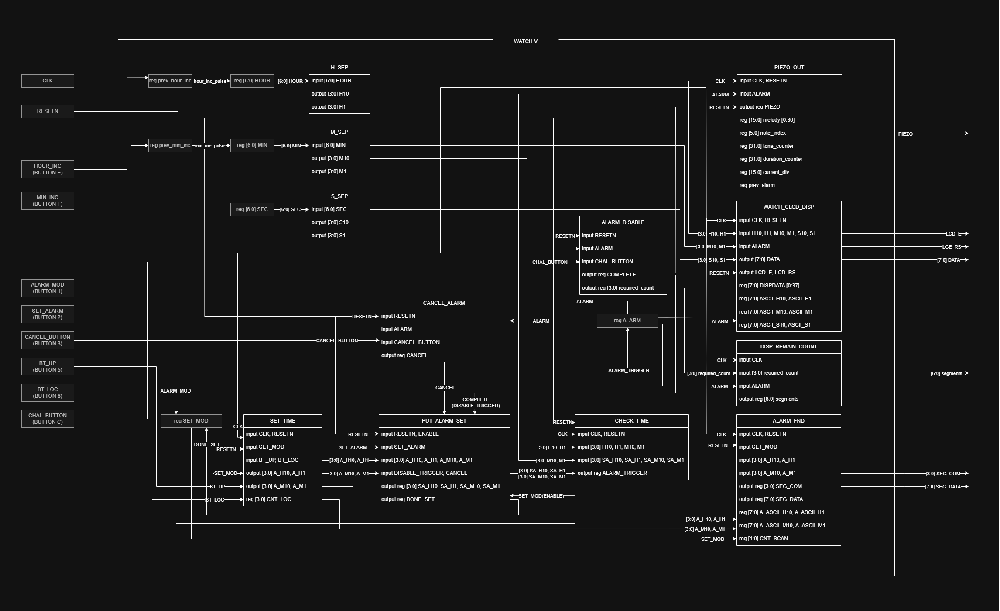

# Project ChronoLogic

## Content
1. [Overview](#1-overview)
2. [Project Introduction](#2-project-introduction)
3. [Requirements Definition](#3-requirements-definition)
4. [System Design](#4-system-design)
5. [Implementation Detail](#5-implementation-detail)
6. [Improvements](#6-improvements)

## 1. Overview

## 2. Project Introduction

## 3. Requirements Definition

## 4. System Design

### System Architecture

1. WATCH.v : Top-level module
2. WATCH_SEP.v
    1. H_SEP.v : Unit division of hour
    2. M_SEP.v : Unit division of minute
    3. S_SEP.v : Unit division of second
3. WATCH_CLCD_DISP.v : Display time and alarm message on Character LCD
4. SET_TIME.v : Toggle alarm setting mode (Enable/Disable)
5. PUT_ALARM_SET.v : Configure alarm for the specified time
6. PIEZO_OUT.v : Piezo Buzzer for melody playback
7. DISP_REMAIN_COUNT.v : Display remaining attempts to deactivate the alarm
8. CHECK_TIME.v : Compare the current time with the configured alarm time
9. CANCEL_ALARM.v : Cancel the configured alarm time
10. ALARM_FND.v : Display alarm time currently being set with FND Array
11. ALARM_DISABLE.v : Control function to deactivate the alarm

### Stack

 <!-- Verilog HDL -->

## 5. Implementation Detail

## 6. Improvements